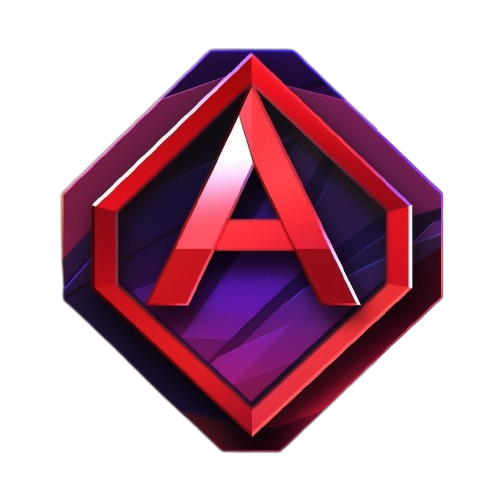

<h1 align="center">Angular Classic - A different view on our beloved Angular</h1>

<p align="center">
  
  <br>
  <i>Angular Classic is a development platform for building mobile and desktop web applications
    <br> using TypeScript/JavaScript and other languages.</i>
  <br>
</p>

<p align="center">
  <a href="https://www.angular-classic.com"><strong>www.angular-classic.com</strong></a>
  <br>
</p>

<p align="center">
  <a href="CONTRIBUTING.md">Contributing Guidelines</a>
  ·
  <a href="https://github.com/ng-classic/ng-classic/issues">Submit an Issue</a>
  ·
  <a href="https://blog.angular-classic.com/">Blog</a>
  <br>
  <br>
</p>


## Documentation

Get started with Angular, learn the fundamentals and explore advanced topics on our documentation website.

- [Getting Started][quickstart]
- [Architecture][architecture]
- [Components and Templates][componentstemplates]
- [Forms][forms]
- [API][api]

### Advanced

- [Angular Classic Elements][angularelements]
- [Server Side Rendering][ssr]
- [Schematics][schematics]
- [Lazy Loading][lazyloading]
- [Animations][animations]

## Development Setup

### Prerequisites

- Install [Node.js] which includes [Node Package Manager][npm]

### Setting Up a Project

Install the Angular Classic CLI globally:

```
npm install -g @angular-classic/cli
```

Create workspace:

```
ng new [PROJECT NAME]
```

Run the application:

```
cd [PROJECT NAME]
ng serve
```

Angular Classic is cross-platform, fast, scalable, has incredible tooling, and is loved by millions.

## Quickstart

[Get started in 5 minutes][quickstart].


- [Angular Classic  Command Line (CLI)][cli]

## Changelog

[Learn about the latest improvements][changelog].

## Upgrading

Check out our [upgrade guide](https://update.angular-classic.com/) to find out the best way to upgrade your project.

## Contributing

### Contributing Guidelines

Read through our [contributing guidelines][contributing] to learn about our submission process, coding rules, and more.

### Want to Help?

Want to report a bug, contribute some code, or improve the documentation? Excellent! Read up on our guidelines for [contributing][contributing] and then check out one of our issues labeled as <kbd>[help wanted](https://github.com/ng-classic/ng-classic/labels/help%20wanted)</kbd> or <kbd>[good first issue](https://github.com/ng-classic/ng-classic/labels/good%20first%20issue)</kbd>.

### Code of Conduct

Help us keep Angular Classic open and inclusive. Please read and follow our [Code of Conduct][codeofconduct].

## Community (Coming soon)

**Love Angular? Give our repo a star :star: :arrow_up:.**

[contributing]: CONTRIBUTING.md
[quickstart]: https://angular-classic.com/start
[changelog]: CHANGELOG.md
[ng]: https://angular-classic.com
[documentation]: https://angular-classic.com/docs
[cli]: https://cli.angular-classic.com/
[architecture]: https://angular-classic.com/guide/architecture
[componentstemplates]: https://angular-classic.com/guide/displaying-data
[forms]: https://angular-classic.com/guide/forms-overview
[api]: https://angular-classic.com/api
[angularelements]: https://angular-classic.com/guide/elements
[ssr]: https://angular-classic.com/guide/universal
[schematics]: https://angular-classic.com/guide/schematics
[lazyloading]: https://angular-classic.com/guide/lazy-loading-ngmodules
[node.js]: https://nodejs.org/
[npm]: https://www.npmjs.com/get-npm
[codeofconduct]: CODE_OF_CONDUCT.md
